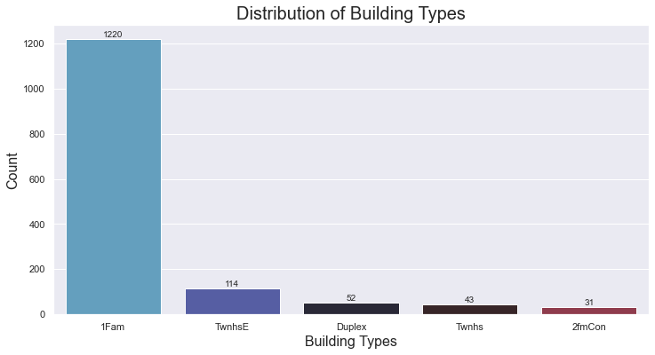
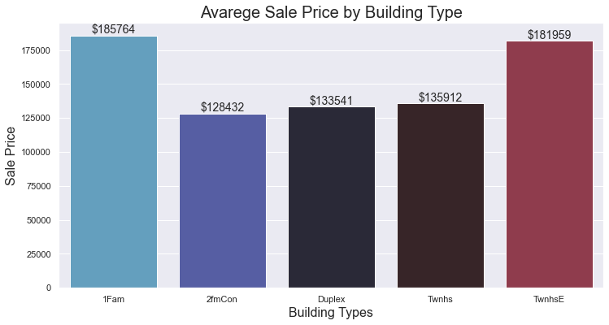
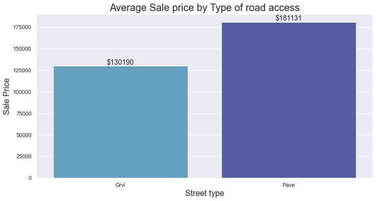
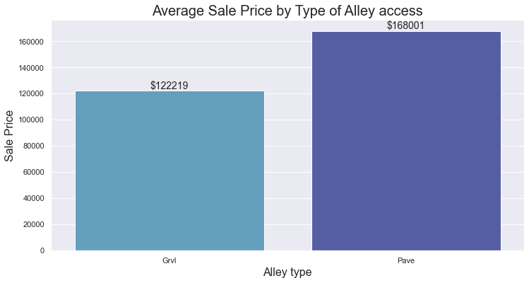
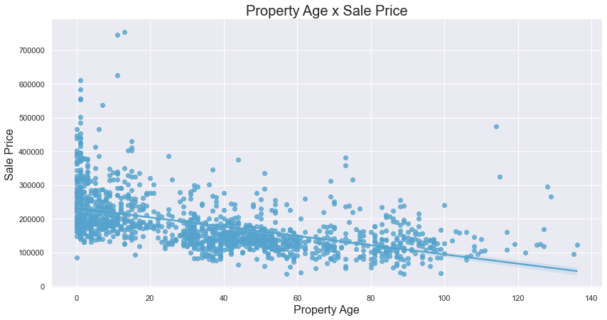
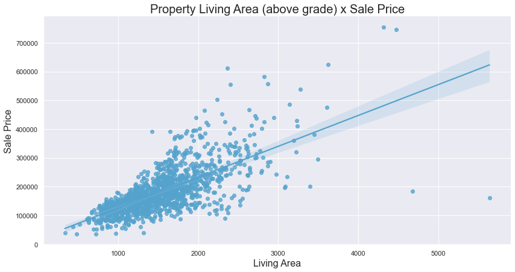
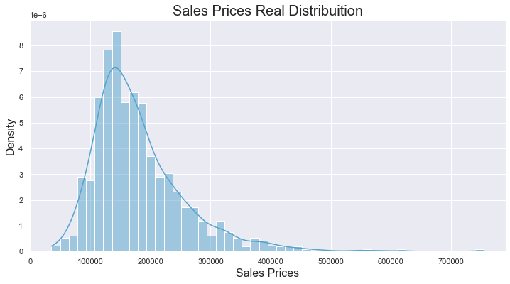
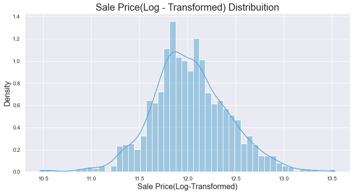

# House Prices Prediction 

## Project Description

Welcome to the House Prices Prediction project! This data science initiative aims to predict house prices using advanced regression techniques. We utilize the "House Prices: Advanced Regression Techniques" dataset from Kaggle, which comprises various features related to residential properties.

## Dataset

- **Source:** [House Prices: Advanced Regression Techniques](https://www.kaggle.com/c/house-prices-advanced-regression-techniques/data)
- **Description:** The dataset includes features such as the number of bedrooms, location, garage presence, etc. The primary goal is to predict house prices. For detailed information, refer to the "data_description.txt" file.
- **Dataset used to Train the model:** "train.csv"

## Required Libraries 

This project leverages the following Python libraries:

- [Pandas](https://pandas.pydata.org/): For data manipulation and analysis.
- [Seaborn](https://seaborn.pydata.org/): For data visualization.
- [NumPy](https://numpy.org/): For numerical operations on data.
- [Scikit-learn](https://scikit-learn.org/): For machine learning modeling and evaluation.

## Exploratory Analysis

### Questions to Explore

During this stage, I considered questions that could help us understand features and their impact on sale prices. Additionally, I created graphs to visualize these relationships. Here are the questions I deemed most pertinent and worthy of highlighting,

## 1. Distribution of Dwelling Types and Their Relation to Sale Prices

The Building type attribute represents the type of dwelling for each property in the dataset. Here's a brief explanation for each category:

- 1Fam (Single-family Detached): Indicates a standalone, single-family dwelling. It is a structure intended for and occupied by one family.

- 2FmCon (Two-family Conversion; originally built as one-family dwelling): Represents a property originally constructed as a single-family dwelling but converted into a two-family dwelling.

- Duplx (Duplex): Refers to a building with two separate living units, each with its own entrance.

- TwnhsE (Townhouse End Unit): Denotes an end unit in a row of townhouses. Townhouses are typically multi-story homes with shared walls.

- TwnhsI (Townhouse Inside Unit): Represents an inside unit in a row of townhouses, indicating a townhouse that is not at either end of the row.

Considering these categories, I opted to create a distribution graph to determine the most common building types. Additionally, I generated a graph showcasing the average sale prices for each type to facilitate comparisons.

### Visualizing the distribution of building types.

### Comparing the average sale price of each type of building.

These graphs highlight that despite the single-family type being the most common, it still commands the highest average sale price.

## 2. Does Street and Alley Access Types Affect Sale Price?

There are two types of both alley and street access to the property. Now, I want to compare how these two types can potentially impact sales prices.

Types of Road and Alley Access:
- Grvl (Gravel): The access road or alley is covered with gravel, which consists of small, loose stones.

- Pave (Paved): The access road or alley is paved, meaning it is covered with a hard, smooth surface, such as asphalt or concrete.

### Comparing Average Sale Price for Gravel and Paved for street access

### Comparing Average Sale Price for Gravel and Paved for alley access

Both graphs strongly suggest that a paved access can enhance the Sale Price of the property.

## 3. Correlation Between Property Age and Sale Price

In analyzing the dataset, I calculated the property age by subtracting the year built from the year sold. Following this, I assessed the correlation between the property age and sale price, revealing the strength and direction of their relationship.

To provide a visual representation of how property age impacts sale prices, a scatter plot with a regression line was generated. This graph illustrates the trend between property age and sale price, allowing for an intuitive understanding of their relationship.

This graph suggests that property age likely has a direct impact on the sale price, indicating that as a property ages, its sale price tends to decrease.
## 4. Correlation Between Living Area and Sale Price

Exploring the dataset, I wanted to verify the correlation between the living area above grade and sale price to uncover their connection. The living area above grade refers to the total habitable area in a home, excluding basements and other non-livable spaces. This includes areas such as bedrooms, living rooms, and kitchens.

The subsequent scatter plot, augmented with a regression line, provides a visual depiction of how changes in the living area above grade correspond to fluctuations in sale prices. This analysis helps discern the impact of the living area on property values, offering insights into how variations in living space relate to changes in sale price

In summary, the graph suggests that the living area above grade has a discernible impact on the sale price. As the living area increases, there is a tendency for the sale price to also rise.
## Data Preprocessing

In this section, I undertook two essential tasks for data preparation. First, I created a normalized version of the dependent variable, SalePrice, by applying a logarithmic transformation. This normalization is often done to improve the distribution characteristics of the variable, so it can better align with a normal distribution.

### Sale Price Distribuition Before Normalization

### Sale Price Distribuition After Normalization

Following this, I addressed an anomaly where the MSSubClass, a feature identifying the type of dwelling, was incorrectly categorized as a numerical feature instead of a categorical one. I corrected this by explicitly converting MSSubClass to a categorical feature.

To facilitate the handling of numerical and categorical features in my analysis, I established a data preprocessing pipeline. This pipeline includes transformers for both types of features, handling missing values and applying appropriate scaling or encoding. The numerical transformer imputes missing values with the mean and scales the data, while the categorical transformer fills missing values with a constant and applies one-hot encoding.

The final step involved the creation of a comprehensive data preprocessing pipeline using the ColumnTransformer, which enables simultaneous application of transformations to both numerical and categorical columns. This streamlined approach ensures consistency and accuracy in preparing the dataset for subsequent analysis and modeling.
## Model Training

In this section. Three different regression models wete chosen for evaluation: Linear Regression, Random Forest, and Gradient Boosting.

For each model, a set of hyperparameters was defined to explore various configurations. The GridSearchCV method is employed to perform a systematic search across the hyperparameter space, aiming to find the combination that yields the best performance according to the R-squared metric. R-squared is a measure of how well the model explains the variance in the target variable.

After training and evaluating each model, the best parameters and performance metrics, such as R-squared scores on both the training and test sets, are printed for analysis. The trained models are stored for future use. The goal is to identify the model and hyperparameters that provide the best fit for predicting house prices based on the given features.

## Results

In this section, an analysis of the models is presented, focusing on three regression models: Linear Regression, Random Forest Regressor, and Gradient Boosting Regressor.

### Linear Regression Model
The R-squared scores for the Linear Regression model suggested a potential issue with overfitting, prompting further investigation. A learning curve was plotted to visualize the model's performance across different training sizes. Cross-validation scores were also computed to assess the model's generalization ability. The results indicated overfitting, with extremely low cross-validated R-squared scores.

### Random Forest Regressor Model
For the Random Forest Regressor, a learning curve was plotted to assess its learning behavior. Cross-validation scores were computed to evaluate its performance. Additionally, predictions were made using the test dataset, and the residual errors (differences between predicted and actual values) were analyzed. The model demonstrated good performance, with high cross-validated R-squared scores and relatively small residual errors.

### Gradient Boosting Regressor Model
Similar to the Random Forest model, a learning curve was plotted to assess the Gradient Boosting Regressor's learning behavior. Cross-validation scores were computed to evaluate its performance. Predictions were made using the test dataset, and the residual errors were analyzed. The model exhibited excellent performance, with high cross-validated R-squared scores and small residual errors.

### Model Comparison and Conclusion
After thorough testing, it was evident that the Gradient Boosting model outperformed the others, demonstrating higher cross-validated R-squared scores and smaller residual errors. Consequently, the Gradient Boosting Regressor was selected as the preferred model for making predictions in this house price prediction project.